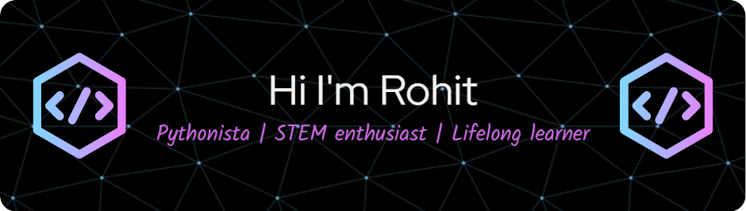

---

## 🙂 About Me

- 🎓 **B.Tech student** at Amrita Vishwa Vidyapeetham, specializing in **Artificial Intelligence**
- 💡 Passionate about **AI, Machine Learning, and Competitive programing**
- 📚 **Hobbies**: Experimenting tech, listening to **self-help & sci-fi audiobooks**, watching **TED Talks**

---

## 🛠️ Tech Stack

### 💻 Programming & Scripting

### 🏗️ Frameworks & Libraries

### ⚙️ Tools & Platforms

<!-- 

 -->

---

## 📊 LeetCode Stats

---

## 📫 Contact Me

---
